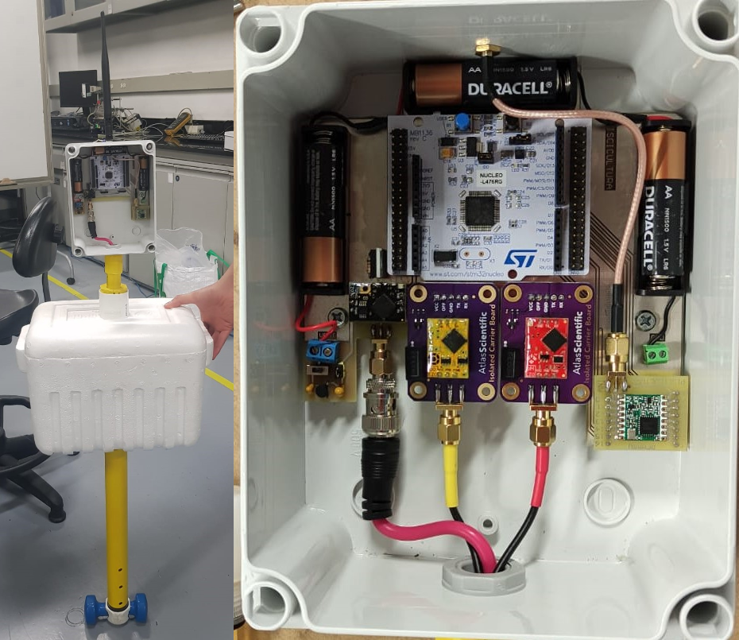
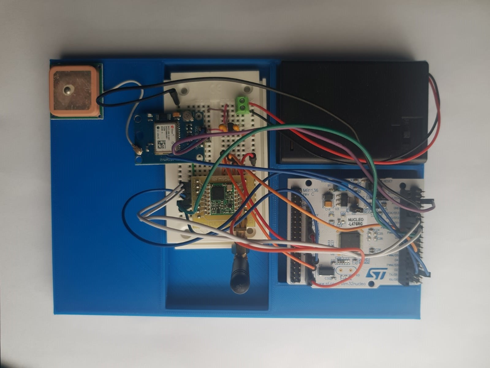
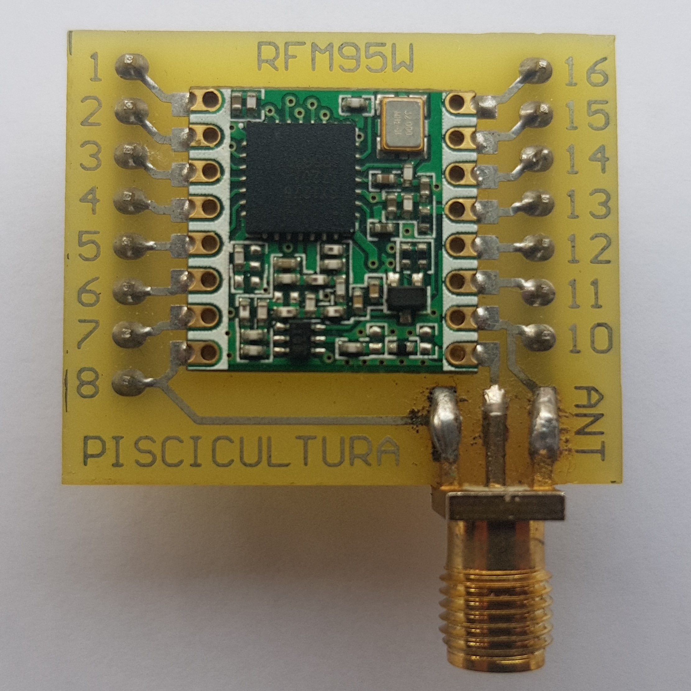

# Open-source fish farming prototype for remote monitoring of water quality variables

In this project we present the design of an open-source and low-cost buoy prototype for remote monitoring of water quality variables in fish farming. The designed battery-powered system periodically measures temperature, pH and dissolved oxygen, transmitting the information locally through LoRaWAN, a low-power wide-area network protocol, to a gateway connected to a cloud service for data storage and visualization. We provide a novel buoy design that can be easily constructed with off-the-shelf materials, delivering a stable anchored float for the IoT device and the probes immersed in the water pond. All the elements of this design, including hardware and software designs, are freely available under permissive licenses as an open-source project. Please, first read the paper that presents this project for further details of the design and field test at an operating fish farm.

This repository presents 3 prototypes for fish farming applications based on LoRaWAN. 

## Article

LINK A PLOSONE

PARA CITAR: 
[CITA]

Bibtex

## Sections

### Data buoy node

   

This is a device for remote monitoring of temperature, pH and dissolved oxygen variables in fish farming. The data buoy floats on the fish pond and periodically transmits these three values to an on-site gateway that forwards the data to an AWS database. The software, hardware and mechanical structure files can be found inside the [data-buoy-node](https://github.com/open-pisciculture/open-source-fish-farming-prototypes/tree/main/data-buoy-node) folder.

### GPS node

   

This system transmits GPS coordinates each time the user presses a button to an on-site gateway and saves the data in an AWS database alongisde LoRaWAN packet information. This device can be used for LoRaWAN coverage sampling. The software and circuit schematics are available inside the [gps-node](https://github.com/open-pisciculture/open-source-fish-farming-prototypes/tree/main/gps-node) folder.

### RFM95W breakout board

   

A simple breakout board for an RFM95W module for easier prototyping with a breadboard. Hardware files are available inside the [rfm95w-breakout](https://github.com/open-pisciculture/open-source-fish-farming-prototypes/tree/main/rfm95w-breakout) folder.

## General
This section includes guides and information that are common to the various prototypes. 

- LoRaWAN Gateway and Device setup
- Removing the ST-Link programmer from the NUCLEO-64 boards
- Amazon Web Services (AWS) services implementation

## Attribution

- The PCB designs use 3D models, symbols and footprints from [SnapEDA](https://www.snapeda.com/).
- The data buoy mechanical assemblies use 3d models from [Atlas Scientific](https://atlas-scientific.com/).

## Licenses

<table>
<thead>
  <tr>
    <th colspan="2">Open Source Licenses</th>
  </tr>
</thead>
<tbody>
  <tr>
    <td>Software</td>
     <td><a href="https://opensource.org/licenses/MIT">MIT License</a></td>
  </tr>
  <tr>
    <td>Hardware</td>
    <td><a href="https://ohwr.org/cern_ohl_p_v2.pdf">CERN-OHL-P</a></td>
  </tr>
  <tr>
    <td>Documentation</td>
    <td><a href="http://creativecommons.org/licenses/by/4.0/">CC BY 4.0</a></td>
  </tr>
</tbody>
</table>

### Software
The software is licensed under an [MIT License](https://opensource.org/licenses/MIT). A copy of the license has been included in the repository and can be found [here](https://github.com/open-pisciculture/temp-open-fish-farming/blob/main/LICENSE-MIT.txt).

### Hardware
The hardware design files are licensed under a CERN Open Source Hardware license version 2 CERN-OHL-P. Details of the license can be found [here](https://ohwr.org/project/cernohl/wikis/Documents/CERN-OHL-version-2) and a copy of the license has been included [here](https://github.com/open-pisciculture/temp-open-fish-farming/blob/main/LICENSE-CERN-OHL-P.txt).

### Documentation
 This work is licensed under a <a rel="license" href="http://creativecommons.org/licenses/by/4.0/">Creative Commons Attribution 4.0 International License</a>.
