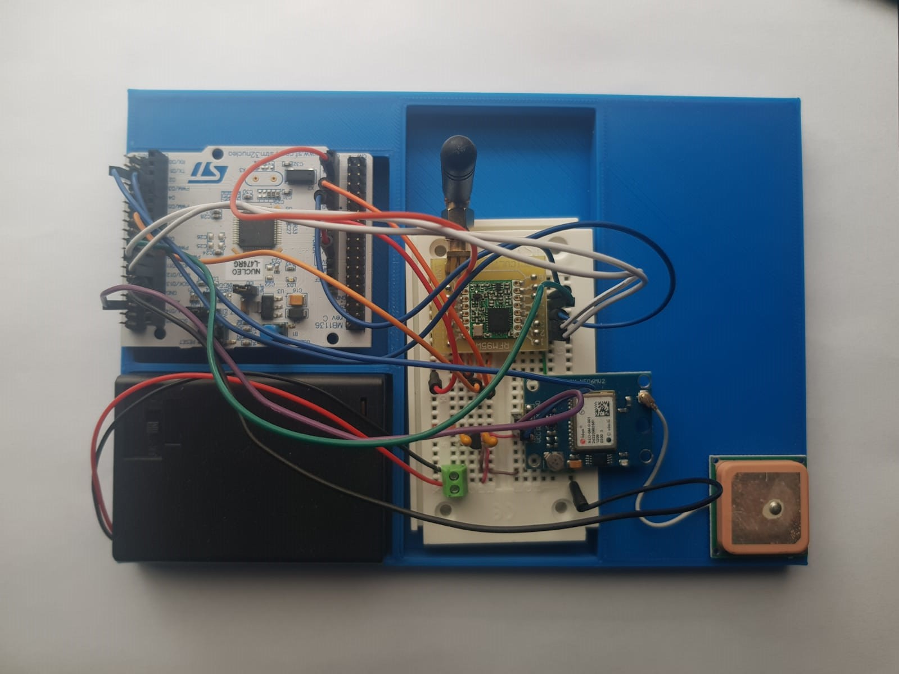
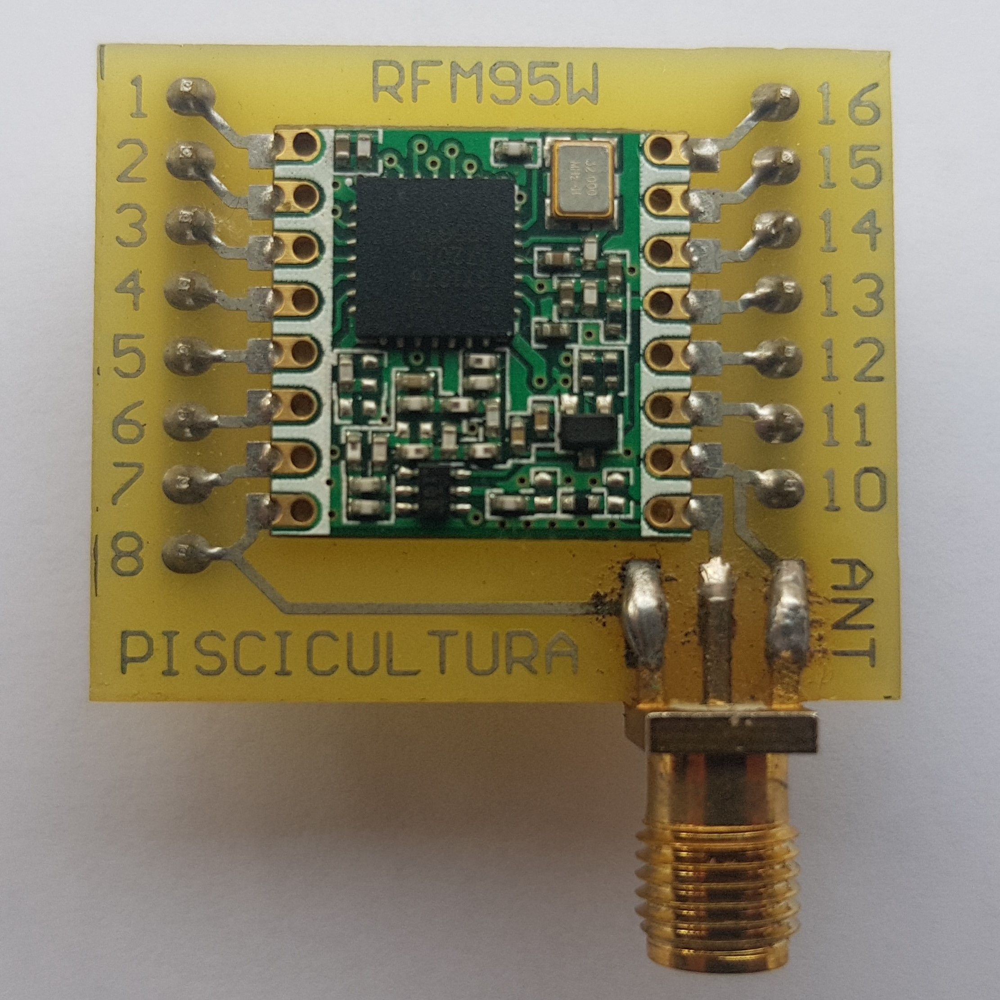

# Open-source fish farming prototypes

This repository presents 3 prototypes for fish farming applications based on LoRaWAN.

## Sections

### Data buoy node
<figure>
   

This is a device for remote monitoring of temperature, pH and dissolved oxygen variables in fish farming. The data buoy floats on the fish pond and periodically transmits these three values to an on-site gateway that forwards the data to an AWS database. The software, hardware and mechanical structure files can be found inside the [data-buoy-node](https://github.com/open-pisciculture/open-source-fish-farming-prototypes/tree/main/data-buoy-node) folder.

### GPS coordinates node

   

This system transmits GPS coordinates each time the user presses a button to an on-site gateway and saves the data in an AWS database alongisde LoRaWAN packet information. This device can be used for LoRaWAN coverage sampling. The software and circuit schematics are available inside the [gps-node](https://github.com/open-pisciculture/open-source-fish-farming-prototypes/tree/main/gps-node) folder.

### RFM95W breakout board

   

A simple breakout board for an RFM95W module for easier prototyping with a breadboard. Hardware files are available inside the [rfm95w-breakout](https://github.com/open-pisciculture/open-source-fish-farming-prototypes/tree/main/rfm95w-breakout) folder.

## General
This section includes guides and information common to the various prototypes. 

- LoRaWAN Gateway setup
- Removing the ST-Link programmer from the NUCLEO-64 boards

## Article

LINK A PLOSONE

PARA CITAR: 
[CITA]

Bibtex

## Licenses

### Software
The software is licensed under an [MIT License](https://opensource.org/licenses/MIT). A copy of the license has been included in the repository and can be found [here](https://github.com/open-pisciculture/temp-open-fish-farming/blob/main/LICENSE-MIT.txt).

### Hardware
The hardware design files are licensed under a CERN Open Source Hardware license version 2 CERN-OHL-P. Details of the license can be found [here](https://ohwr.org/project/cernohl/wikis/Documents/CERN-OHL-version-2) and a copy of the license has been included [here](https://github.com/open-pisciculture/temp-open-fish-farming/blob/main/LICENSE-CERN-OHL-P.txt).

### Documentation
 This work is licensed under a <a rel="license" href="http://creativecommons.org/licenses/by/4.0/">Creative Commons Attribution 4.0 International License</a>.
