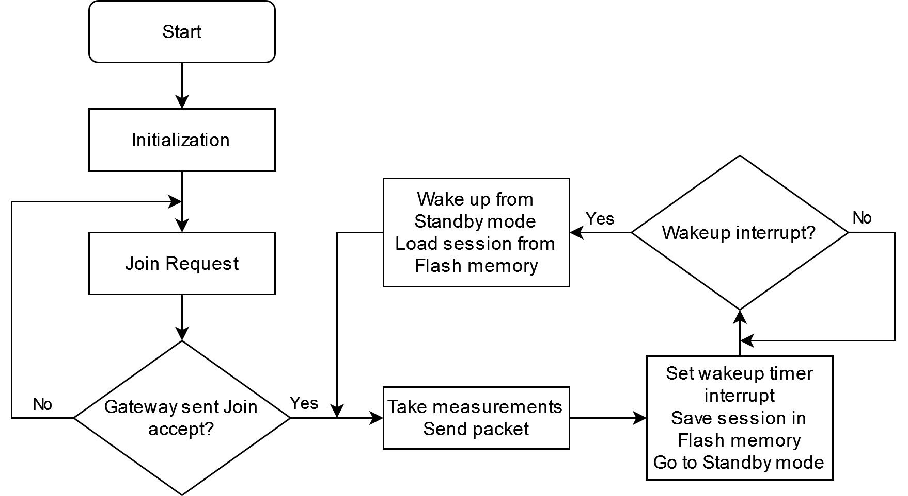

# Data buoy prototype

This is a prototype for remote monitoring of temperature, pH and dissolved oxygen variables for applications in fish farming.

## Overview

The device is

## Instructions

Before assembling the data buoy, make sure to follow the initial instructions for setting up a LoRaWAN gateway and node available [here](https://github.com/open-pisciculture/open-source-fish-farming-prototypes/tree/main/general) and also configure the services in AWS detailed [here](https://github.com/open-pisciculture/open-source-fish-farming-prototypes/tree/main/data-buoy-node/cloud).

## Usage

## Additional

