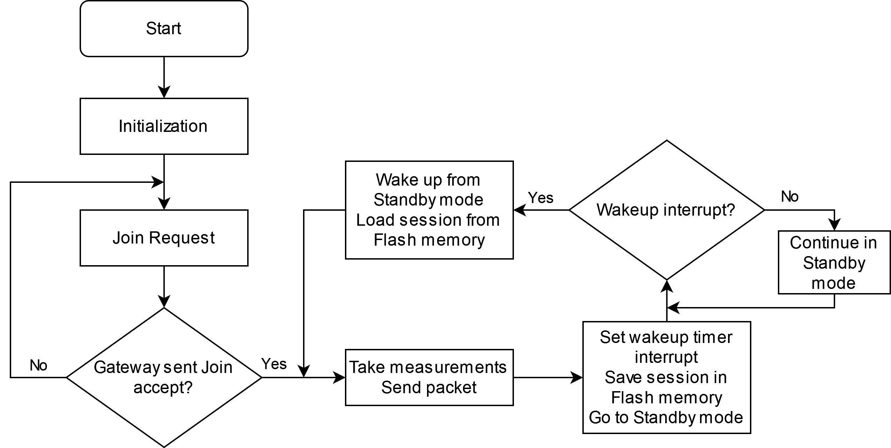

# Data buoy prototype

  

## Overview

The device is a data buoy prototype for measuring water quality variables. It uses sensors from [Atlas Scientific](https://atlas-scientific.com/) to measure temperature, pH and dissolved oxygen and transmits the data using LoRaWAN. This section includes the program code as an STM32CubeIDE project, the Altium project and Gerber files for the printed circuit board and the mechanical parts for assembly of the buoy. 

## Instructions

### Prerequisites
Before assembling the data buoy, make sure to follow the initial instructions for setting up a LoRaWAN gateway and end device available [here](https://github.com/open-pisciculture/open-source-fish-farming-prototypes/tree/main/general). Live data can be monitored through the console in The Things Network if everything is working correctly. The breakout board used for the RFM95W module is also included in this repository. Refer to [this section](https://github.com/open-pisciculture/open-source-fish-farming-prototypes/tree/main/rfm95w-breakout) for the breakout board hardware files.

### Switching the Atlas Scientific circuits to I2C mode
The EZO line of circuits can be used in both UART and I2C mode. By default, they come in UART mode and must be changed to I2C mode before assembling the buoy. 
A simple code for doing this has been included [here](https://github.com/open-pisciculture/open-source-fish-farming-prototypes/tree/main/data-buoy-node/software/switch-atlas-i2c). Connect the sensor to the NUCLEO-L476RG board indicated as follows and run the code with the desired I2C address. This code will only work in UART mode.

| Nucleo pin | EZO circuit pin |
|------------|-----------------|
| 3V3        | VCC             |
| GND        | GND             |
| CN7 Pin 2  | TX              |
| CN7 Pin 1  | RX              |

Use the following I2C addresses:

| EZO circuit      | I2C Address |
|------------------|-------------|
| RTD Temperature  | 102         |
| pH               | 103         |
| Dissolved Oxygen | 104         |

Feel free to change the I2C addresses to other values. Make sure to change the SENSOR_I2C_ADDRESS macros in the main.c file and use valid numbers between 1 and 127. Check the Atlas circuit datasheets for details.

### Program code editing
Edit the following in the main.c file:
- Specify the sampling period in the SLEEP_SECONDS constant in seconds
- Follow the [Setting LoRaWAN configuration for each device](https://github.com/open-pisciculture/open-source-fish-farming-prototypes/tree/main/general) section to add the device-specific information from The Things Network

For instructions to program the board if the ST-Link programmer was removed refer to this [section](https://github.com/open-pisciculture/open-source-fish-farming-prototypes/tree/main/general).

### Mechanical assembly
A guide for the assembly of the prototype has been included and can be consulted in the [assembly_guide](https://github.com/open-pisciculture/open-source-fish-farming-prototypes/blob/main/data-buoy-node/assembly_guide.docx) word document.

## Usage
1. Turn on the device. Each sensor circuit will briefly light up and blink blue while the microcontroller reads each value.
2. The microcontroller led will turn on while reading the sensors and transmitting the measurements. Once the packets have been successfully transmitted, the microcontroller will sleep.
3. After the specified sampling period has passed, the microcontroller will wake up, read the sensors, transmit the values and enter sleep mode. This cycle will repeat. 

## Additional

