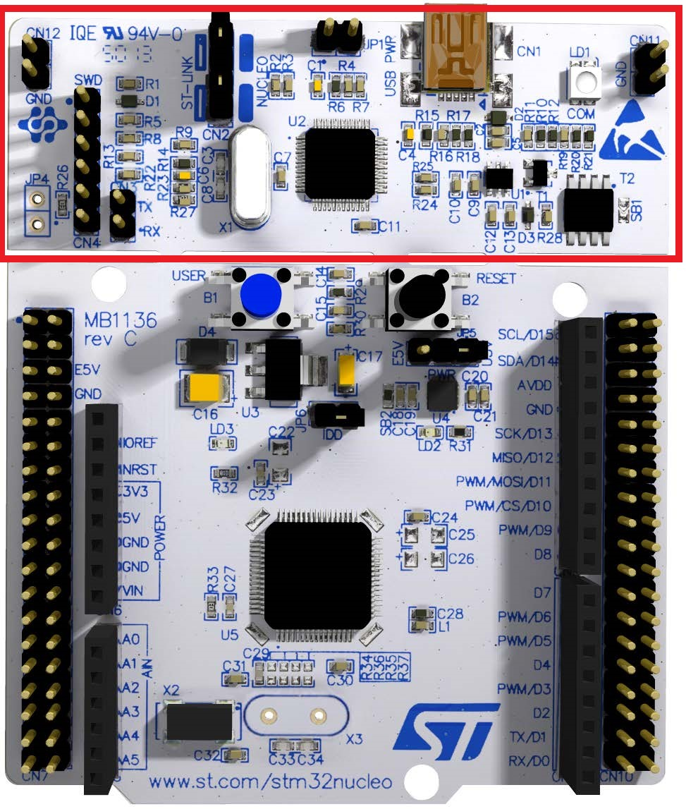
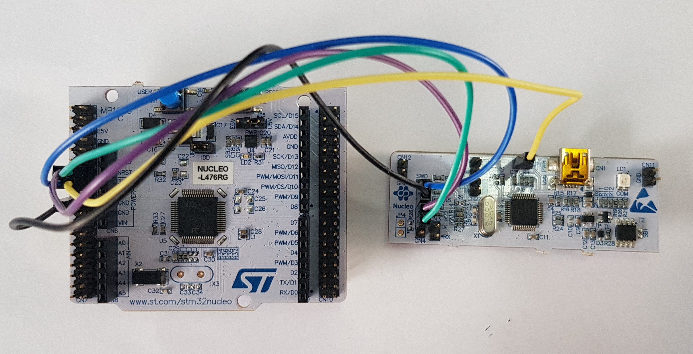

# General

Here supporting information common to various prototypes can be found.

- Setting up the LoRaWAN Gateway with The Things Network
- Creating devices in The Things Network
  - Device payload formatters
- Setting up LoRaWAN configuration for each device in the C program
- Removing ST-Link Programmer Nucleo board
- Programming the NUCLEO board with the removed programmer
- Removing the Nucleo board solder bridges
- Deployment of AWS services

## Setting up the LoRaWAN Gateway with The Things Network
The Gateway used for this prototype is [this one](https://www.sparkfun.com/products/16447). First, make sure to follow the Getting Started Guide available under the Documents tab in the [Sparkfun website](https://cdn.sparkfun.com/assets/8/3/6/d/4/Getting_Started_Guide_for_RAK7244_V1.0.pdf). Section 6 (Connecting the Gateway to TTN) of this guide includes instructions for The Things Network V2, which is no longer maintained. See [this guide](https://www.thethingsindustries.com/docs/gateways/adding-gateways/) for instructions to add the Gateway to The Things Stack V3.

## Creating devices in The Things Network
Refer to the [Manually Registering an End Device](https://www.thethingsindustries.com/docs/devices/adding-devices/#manually-registering-an-end-device) section guide from The Things Network for instructions to add a device. For the project as presented in this repository, the following options are used:

- LoRaWAN version: LoRaWAN Specification 1.0.3
- Frequency plan: United States 902-928 MHz, FSB 2 (used by TTN)
- Regional Parameters version: RP001 Regional Parameters 1.0.3 revision A
- LoRaWan class capabilities unchecked for both Supports class B and Supports class C

Verify the frequency plan assigned to LoRaWAN in your country before registering your device. A good starting point can be [Frequency Plans by Country](https://www.thethingsnetwork.org/docs/lorawan/frequencies-by-country/) from The Things Network. However, this is NOT an official document and you should make sure to check your country's regulations.

### Device payload formatters
The payload formatter javascript code used for each device is included inside the software folder for the [GPS](https://github.com/open-pisciculture/open-source-fish-farming-prototypes/blob/main/gps-node/software/ttn/payload_formatter.txt) and the [data-buoy](https://github.com/open-pisciculture/open-source-fish-farming-prototypes/blob/main/data-buoy-node/software/ttn/payload_formatter.txt) nodes. It can be copied to each device's payload formatter to correctly retrieve the data. 

## Setting LoRaWAN configuration for each device
Each device (data-buoy-node and gps-node) has three constants in the main.c file that should be edited according to the information from The Things Stack. Refer to your particular device's Overview tab in the Console and copy the following information:

- APPEUI should be set to the information in the AppEUI field. This must be in lsb format. Make sure to switch the byte order in the Console to lsb before copying.
- DEVEUI should correspond to the information in the DevEUI field. Similar to before, it must be in lsb format. Switch the byte order before copying.
- APPKEY contains the information in the AppKey field. This must be in msb format, not lsb like the other two cases. Make sure to switch the byte order to msb before copying.

The Activation Information tab in the Console should look similar to the following image (with your particular information for each field):

  

## Removing ST-Link Programmer from Nucleo board
The ST-Link programmer on the Nucleo board can be cut off to remove it. This is the top section of the board, indicated in the following image:

  

Removing the programmer reduces the physical dimensions of the board and also lowers the power consumption. However, the rest of the board has to be connected with jumpers to the removed programmer in order to program and debug it. This is detailed in the next section.

## Programming the NUCLEO board with the removed programmer
This section details the jumper connections required to program and debug the board with the removed programmer. For more details, the reader can refer to the [User manual for STM32 Nucleo-64 boards](https://www.st.com/resource/en/user_manual/um1724-stm32-nucleo64-boards-mb1136-stmicroelectronics.pdf), particularly section 6.2.4.

1. Remove the CN2 jumpers.
2. Connect the removed ST-Link to the rest of the board according to the following table:

| Rest of the board (Left) | Removed ST-Link (Right) | Signal       | Jumper color |
|--------------------------|-------------------------|--------------|--------------|
| CN7 Pin 15 (PA14)        | CN4 Pin 2               | SWCLK        | Blue         |
| CN7 Pin 19               | CN4 Pin 3               | GND          | Black        |
| CN7 Pin 13 (PA13)        | CN4 Pin 4               | SWDIO        | Purple       |
| CN7 Pin 14 (NRST)        | CN4 Pin 5               | NRST         | Green        |
| CN7 Pin 16               | JP1 Pin 1 (Yellow)      | +3V3_ST_LINK | Yellow       |

  

## Removing solder bridges from Nucleo board
Solder bridge SB2 was removed to reduce power consumption and disconnect led LD3 and the unused board 3.3V voltage regulator U4. Refer to the [nucleo board schematics](https://www.st.com/resource/en/schematic_pack/nucleo_64pins_sch.zip) for details on these connections. SB2 is indicated in the following image and can be removed with a soldering iron.

  

Keep in mind that this will disconnect the board voltage regulator. Therefore, the microcontroller will need an external 3.3V power supply, which is why the previous section uses the ST-Link 3.3V power supply for programming.

## Deployment of AWS services

First, make sure to follow the [Deployment Guide](https://www.thethingsindustries.com/docs/integrations/cloud-integrations/aws-iot/deployment-guide/) from The Things Network to deploy the AWS IoT integration for The Things Stack. This will create a CloudFormation stack in you AWS account containing several AWS resources necessary to integrate The Things Networks with your AWS account (follow mentioned documentation above to find out more about them).

Second, in this repository we developed another [CloudFormation template](https://github.com/open-pisciculture/open-source-fish-farming-prototypes/blob/main/general/cloud/iot_lambda_dynamo.template.yaml) including the following resources (*Important note:* there are many ways to handle TTN received data, this way, including a Lambda function, is recommended since it gives the developer more flexibility):

- DynamoDB table where data is sent.
- Lambda function.
- IoT Rule that queries/filters data received via MQTT topic at AWS IoT Core.
- Associated IAM Permissions.

Simply go to the AWS Console > CloudFormation > Create stack > With new resources > Upload a template file > Upload template `open-source-fish-farming-prototypes/general/cloud/iot_lambda_dynamo.template.yaml` > Choose any stack name > Leave everything as default > Create stack. This template has a parameter (`SQLQueryForIoTRule`) which can be adapted to the developer's needs, there are a couple more examples in `open-source-fish-farming-prototypes/general/cloud/queries_aws_iot_rule.txt`.

When appropriately following these steps, you should end up with a `CREATE_COMPLETE` status, you can double check this in the AWS Console > CloudFormation > Search bar '<your stack name>'.

  

