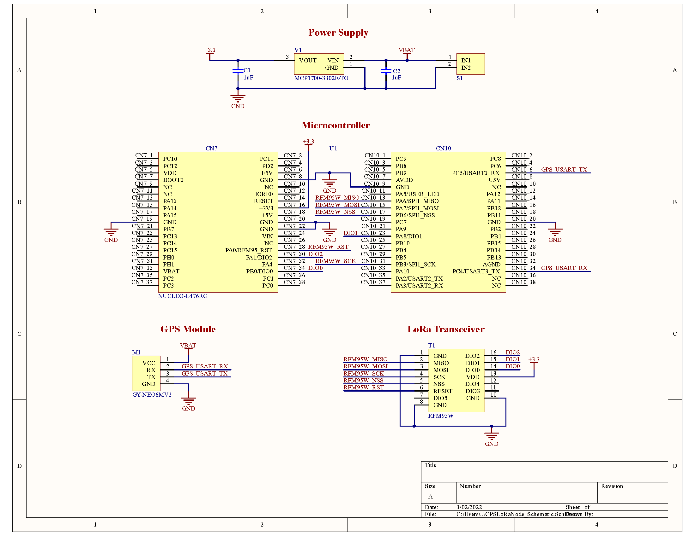
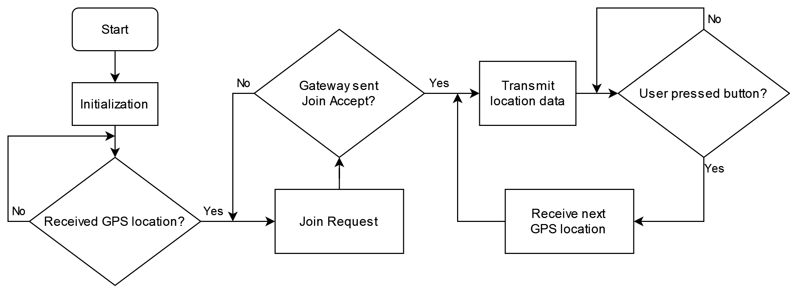

# GPS LoRaWAN node
This is a device for transmitting gps coordinates using LoRaWAN each time the user presses a button. 

## Overview

  

### Component list
- A NUCLEO-L476RG microcontroller board
- Program code as an STM32CubeIDE project
- A GPS module GY-NEO6MV2
- An RFM95W module for LoRaWAN transmissions. For the breakout board used, refer to this [section of the repository](https://github.com/open-pisciculture/temp-open-fish-farming/tree/main/rfm95w-breakout)
- A 3.3V power supply with 3 AA batteries in series and an MCP1700 voltage regulator 
- A simple 3d printed box to organize the circuit

## Prerequisites

### Removing NUCLEO board programmer and solder bridges
The microcontroller board, as presented in the schematics, is supplied by an external 3.3V voltage regulator. This regulator also supplies the other components of the device: the GPS module and the LoRaWAN module. These two components could be supplied by the microcontroller board's 5V output. However, you should be careful about exceeding the maximum current for the pin. For this prototype, the onboard ST-Link programmer and some solder bridges from the board were removed.

#### Removing ST-Link programmer

The onboard ST-Link programmer is indicated in the following image:

#### Programming the microcontroller with the removed programmer

#### Removing solder bridges

## Instructions

### Circuit schematics

### Pin connections

#### RFM95W connections
| NUCLEO pin | RFM95W breakout pin | RFM95W module pin |
|:----------:|:-------------------:|-------------------|
|     D12    |          2          | MISO              |
|     D11    |          3          | MOSI              |
|     D3     |          4          | SCK               |
|     D10    |          5          | NSS               |
|     A0     |          6          | RESET             |
|     A3     |          14         | DIO0              |
|     D7     |          15         | DIO1              |
|     A1     |          16         | DIO2              |
## Usage

1. Turn on the device and wait until the GPS is sending data. The module has a red led that will blink once it's ready.
2. Wait until the device has finished the join process. The board led will start blinking once transmission has been completed.
3. Press the user button (blue button on the board) to transmit the current coordinates. The led will stop blinking while transmission and the user button will be disabled while transmission is in process. It will start blinking again once transmission has been completed, at which point the user button can be pressed again to initiate a new transmission.

## Troubleshooting

The device will wait until it receives data from the GPS module before initiating the join procedure. If the GPS is not sending data, you can check for the following:
- First, verify that the red led from the module is blinking. It may take a bit (~30 seconds or maybe more), so make sure to wait an appropiate amount of time.
- Try using the device outside. The GPS module may have trouble receiving the signal indoors.
- The GPS module integrates a voltage regulator. Make sure that the battery voltage is connected to the module and not the 3.3V output from the regulator.

## License

## Additional

### Program flowchart

