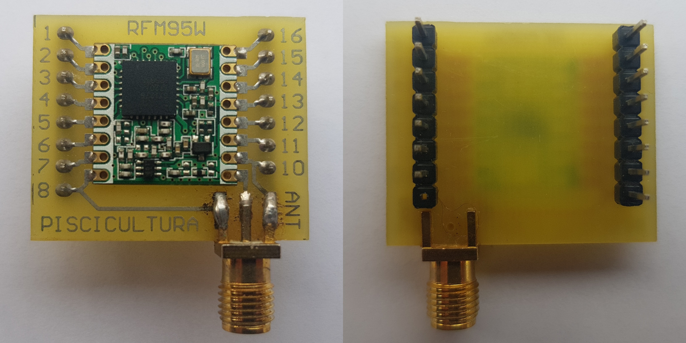

# RFM95W Breakout Board

This is a printed circuit board designed for easier breadboard prototyping with an RFM95W module.

3D models, PCB documentation and manufacturing files are available. The PCB design Altium project is also included. 
